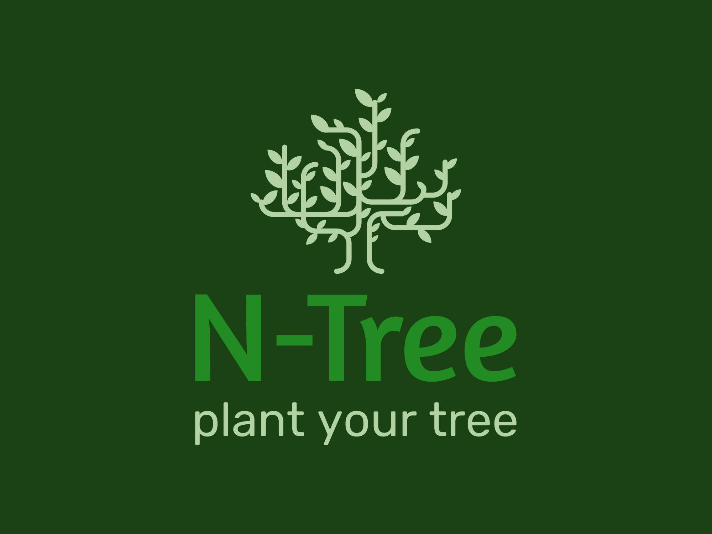

# N-Tree

---

[Завантажити .apk застосунку](n-tree.apk)

---

Застосунок для персонального блогу, який дозволяє користувачам створювати та вести персональні блоги на мобільних пристроях. Здебільшого застосунок орієнтований на використання його як сервіс Linktree, але з додатковими функціями та можливостями, у тому числі — пости можуть бути використані як оголошення, наприклад, про вихід нового музичного альбому автора. Проєкт орієнтований на медійних людей, волонтерів для поширення зборів та благодійної діяльності тощо.
 

